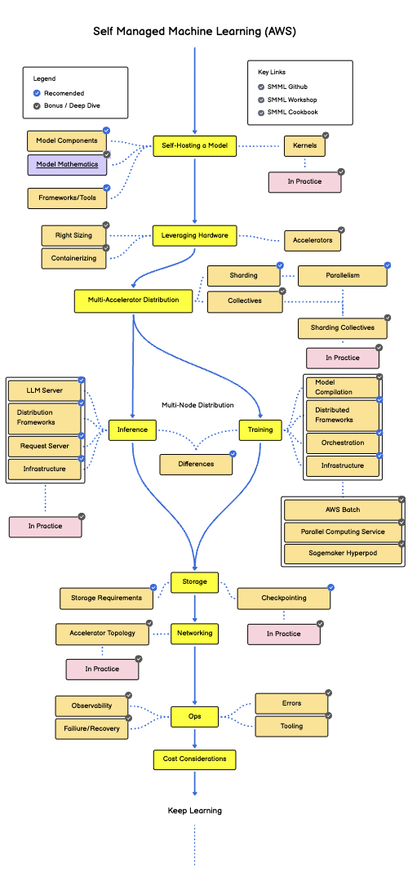

# Self-Managed Machine Learning on AWS: A Comprehensive Cookbook

## Introduction

Welcome to the Self-Managed Machine Learning (SMML) Cookbook for AWS! This guide is designed for ML teams tasked with hosting training and inference workloads for large language models like Llama-Xb. The cookbook provides a structured approach to effectively managing ML workloads at scale while maximizing cost-effectiveness and building a mature platform on AWS.

Whether you're new to self-managed ML or looking to optimize your existing setup, this cookbook will guide you through the complete lifecycle - from understanding model components to deploying high-performance inference endpoints, and everything in between.

## What You'll Learn

* **Model Components**: What assets make up a complete model and how to work with them
* **Hardware Requirements**: Essential knowledge about selecting and configuring appropriate hardware
* **Performance Optimization**: Techniques to extract maximum performance from your infrastructure
* **Workload Distribution**: Methods for distributing ML workloads across single and multiple AWS EC2 instances
* **Scalable Inference**: How to build and manage scalable inference services
* **Comprehensive Monitoring**: How to observe your ML workloads from cluster level down to individual GPU metrics

## Journey Overview

This cookbook follows a practical, hands-on approach with foundational concepts applicable to both training and inference, before diving into specific implementation paths:

1. **Core ML Infrastructure Concepts** (will do with training but concepts applicable to both training & inference)
   - **Model Components & Mathematics** - Understanding the fundamental building blocks of large language models
   - **Self-Hosting a Model** - Setting up your environment to work with models like Llama
   - **Leveraging Hardware** - Optimizing for specific AWS compute instances and accelerators
   - **Multi-Accelerator Distribution** - Techniques for distributing workloads across multiple GPUs

2. **Training & Inference Pathways**
   - **Training** - We will discuss the particulars for training, but part 1 essentially covers this
   - **Inference** - Building robust inference services with optimized request handling, including:
     - LLM Server implementation
     - Distribution frameworks
     - Request handling and optimization
     - Infrastructure considerations

3. **Operational Excellence**
   - **Storage & Networking** - Best practices for model storage, checkpointing, and network optimization
   - **Operations** - Monitoring, observability, error handling, and recovery strategies
   - **Cost Optimization** - Techniques to maximize performance while minimizing costs

## Llama Model Architecture Overview

While this cookbook uses Llama as our reference model, the principles apply to most large language models. To help you understand key terminology:

* **Attention Heads**: Components that allow the model to focus on different parts of the input sequence
* **Context/Sequence Length**: The maximum number of tokens a model can process at once
* **Model Parameters**: The learnable weights that define the model's behavior (measured in billions)
* **Tokenization**: The process of converting text into numerical representations
* **Transformer Architecture**: The foundational architecture behind modern LLMs

For a deeper dive into Llama's architecture, refer to the [SMML GitHub](https://github.com/example/smml) resources.

## Hardware Environment

This cookbook focuses on AWS g6.12xlarge instances equipped with NVIDIA L4 GPUs for demonstration purposes. While production environments would likely use larger instances with more powerful GPUs or specialized accelerators, the concepts presented apply broadly to various hardware configurations:

* Single-instance optimization for both training and inference
* Multi-instance cluster deployment for distributed workloads
* Network and storage configurations optimized for ML

All principles covered can be applied to larger GPUs (like A10G, A100, H100) and different AWS accelerators (like Trainium and Inferentia). One notable difference between our demonstration setup and some production configurations is the absence of high-speed GPU interconnects like NVLink, which we'll specifically address in the relevant sections on multi-accelerator distribution and training.

> Note that while we'll discuss how to deploy and run workloads on these clusters, the cookbook links to external guides for the initial cluster setup.

## Why Learn this Content
<ToDo>
- As you make higher level decisions this is why you see the behavior that you do
- Unerstand conversations with customers in depth

## Key Resources

<!-- * 🧪 [SMML Workshop](https://workshop.example.com/smml) - Hands-on labs and exercises -->
<!-- * 📚 [SMML Cookbook](https://cookbook.example.com/smml) - Detailed guides and recipes -->
* 🗺️ [SMML Roadmap](https://roadmap.sh/r/self-managed-machine-learning) - Visual roadmap version of the cookbook

## Getting Started

To begin your self-managed ML journey:

1. Clone the SMML GitHub repository to access code examples
2. Review the "Model Components" section to understand LLM fundamentals
3. Follow the setup instructions in the "Self-Hosting a Model" section
4. Work through the practical examples, applying concepts to both training and inference scenarios

Throughout this cookbook, you'll find both recommended (core) content and bonus "Deep Dive" material for those wanting to explore topics in greater depth. "In Practice" sections provide real-world applications and case studies to help solidify your understanding.

Let's begin by exploring the components that make up a language model like Llama...

   

