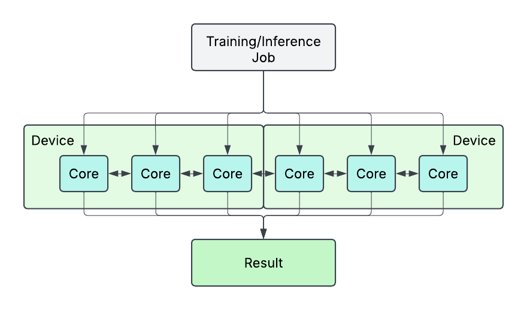
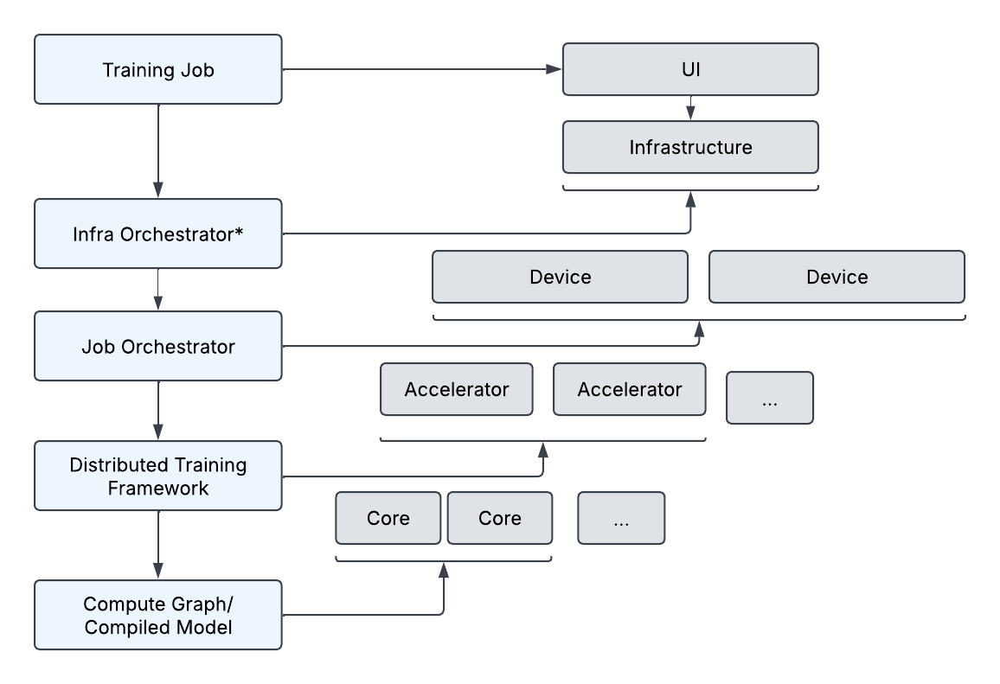

# Training - Overview
As we introduce another layer of complexity here, we want to give you a frame of reference for how to think of the stack you're operating in.

Most of the content we've provided before assumes the following set up:

We have devices interacting with many cores, and these cores can communicate and collaborate with each other. That's how we are able to utilize the sharding and parallisation techniques we refered to before. And each core leveragas collective communication to interact with eah other.

However, in reality, there needs to be something that informs all these cores of their neighbors, their networking, and what portions of the job they are responsible for. That's where orchestrators and distribution frameworks come in. The following image shows how we can break down the problem to each level of the stack we're utilizing once we are at a multi-node solution:

## Training Job

This is where the user submits a training job to kick off a workload. You inform the system how many resources you’ll need, where the data is, and what training script will run. These will be used by downstream systems to determine how to run your program and how to communicate appropriately given the results. This is very similar to classic tightly coupled HPC use-cases like CFD.

At this step you're just saying how many nodes you have, how many devices, and you provide the script that will run on all your devices. 

Common Tools/Frameworks:
* Slurm
* K8
* AWS Batch
* SageMaker Training Jobs
* Ray Train

For hands on examples dive into [Lab1](./module3.training.lab1.ipynb)

## Infra Orchestrator

Depending on the types of jobs you’re doing and what kind of cluster you’re using, at this point infrastructure resources may be spun up or allocated to complete your specified job. This can be deploying containers, spinning up VMs, launching compute jobs on serverless functions. It completely depends on the underlying resource requirements and configuration needs of your workload. For ML, this typically is either containers or compute due to the high compute and memory requirements as well as the tightly coupled series of steps.

Ideally this stage is determining the best infrastructure orchestration for your team to interface with as well as what hardware you need available to you. 

Note this may be done before jobs are submitted in the case of static or shared hardware. In that case, this step is more about securing resources for your job than deploying them.

Common Tools/Frameworks:
* AWS Batch
* Hyperpod
* PCluster
* SageMaker Training Jobs
* Ray
* K8

For hands on experience we suggest reading into the best service for your use case and going through some of the tutorials above. For the purposes of this cookbook, we'll be focusing on what to do once your cluster is deployed.

## Distributed Training Framework

After your infrastructure is in place, and your job has been initiated, the actual script you chose in the first step is run on individual devices. These scripts are what use device resources to parallelize the workload and determine when a training job will stop for collective communication steps. For instance, if you have N accelerators on a device, your distributed training framework will reserve N accelerators and split the workload (according to training job specifications) across those accelerators to effectively compute your job.

These frameworks handle splitting data/models across accelerators, collective communications on and between devices, signaling to other devices that it’s waiting for collective communications, checkpointing, and more.

Because these scripts are provided the “world size” and their current available accelerators,  they can determine what portion of the workload they are responsible for and how many results they should expect to give and take from during collective communications.

Common Tools/Frameworks:

* HF Transformers
* NxDT (for Neuron)
* PyTorch Distributed (FSDP)
* DeepSpeed

For hands on experiencce we encourage you to review the second module [Multi-Accelerator Distribution](../../02_Multi-Acclerator_Distribution/module2.lab1.ipynb)

## Compute Graph/Compiled Model

Whether just in time or done preemptively, the code you write will be compiled to a compute graph for each accelerator. The compute graph is the result of compiling your training script. This optimizes kernels for the hardware you’re running on to fully take advantage of the memory and cores provided. For classic ML with GPUs, this will leverage CUDA and ensure you’re using Tensor Cores, Streaming Processors, Warps, Blocks, etc. to their full extent. For ASICs like Trainium, this step ensures you’re utilizing the different Neuron cores effectively.

It is possible at this stage to write custom kernels as well if the built in optimizations are not appropriate for your use-case, hardware, or software stack.

Once this step happens and the code is ran, before any computation is done, the networking topology is established and you essentially achieve this:

Great! So after all that distribution, we now have a topology that allows us to perform parallelization strategies as if we had one large device with many cores. 

Common Tools/Frameworks:
* PyTorch
* NxDT
* JAX

For hands on experiencce we encourage you to review the intro module [Getting Started With AWS](../../00_Getting_started_with_Aws/Introduction.md) where we cover model components and ML frameworks, as well as how models are "compiled."

## Conclusion
As we mentioned we've actually already walked you through much of the foundation needed for training. Hopefully at this point you can contextualize that into the bigger picture by submitting, monitoring and scaling your jobs on a cluster with more than one node.