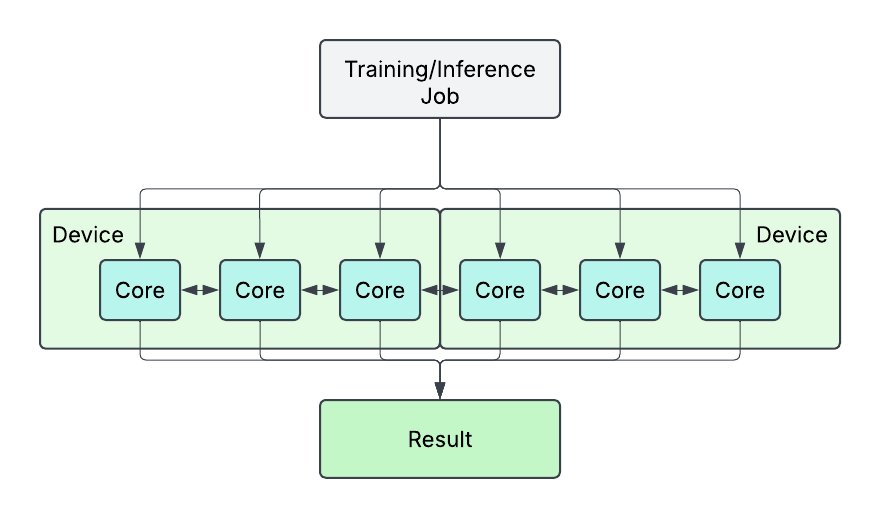
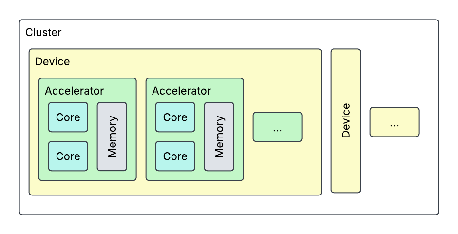
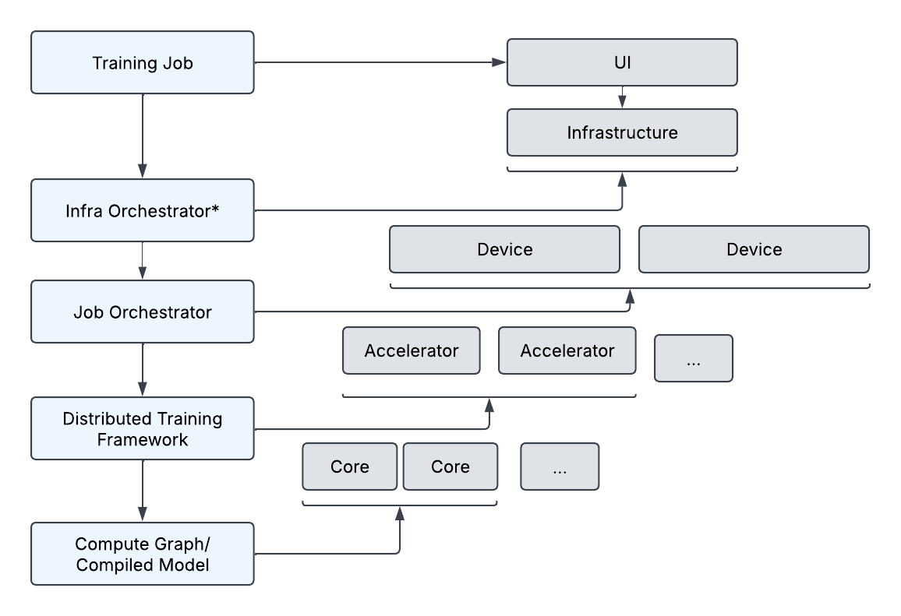

# Appendix
## Definitions
- **Core:** A single unit of compute, typically there will be many of these on a chip or device. These work together to solve problems. This usually 
requires little input from developers at an HPC or ML training scale. 

- **Device:** A device refers to a computing component on a node or computer. These can be CPUs, Accelerators, or GPUs. They typically have many cores, and are the lowest level of computing abstraction a developer at our scale (self managed machine learning) need to be aware of.

- **Accelerator:** An accelerator is an additional compute unit that is attached to a node in addition to a CPU. Their purpose is more specific than a CPU, and is typically used to process large amounts of data in parallel. When we say accelerator this can apply to GPUs, Neuron Cores (AWS's accelerator) or any other third party chips that are not CPUs.

- **GPU:** A GPU is a specific type of accelerator and the most common and accessible. This refers to NVIDIA or AMD's GPUs usually, in the context of these labs we're only refering to NVIDIA GPUs.

- **Node:** A node, instance, or VM is essentially a computer. A node will 
typically have a CPU, RAM, and some block storage (like a solid state drive) to host files and objects that are relevant to that node. Each note will have networking access as well.

- **Job:** A job task assigned to a computing environment to solve and provide output data. This can be training, fine tuning, inference. Thi sis typically not used for real time user interactions. Jobs can utilize 1 GPU or many nodes with multiple GPUs. Jobs are typically submitted through a scheduler/orchestrator.

- **Request:** A request is like a job in that it is sent to a computing environment and is expecting a response. The distinction is the request is typically processed ASAP and is user facing, typically expecting a lower latency than a job. Requests are typically managed by a request server or API layer.

- **Cluster:** A cluster is multiple nodes interacting together to solve a job or a request. Examples of AWS technology that can spin up and help you manage clusters are AWS Parallel Cluster, Parallel Computing Service, SageMaker Hyperpod, and Elastic Kubernetes Service.

- **Orchestrator:** An orchestrator or scheduler is used to schedule and manage jobs across a computing environment. This may be scheduling  jobs typically on a compute environment with more than one node. They are responsible for queing jobs, batching jobs together, or splitting jobs across multiple nodes. Some examples are slurm, kubernetes, volcano, and ray.
## Environment
We are utilizing the following architecture:
ToDo

This includes 2 g6.12xlarges each with 4 L4 GPUs on this. This was the smallest most up to date series of GPUs that allow us to demonstrate the majority of the concepts needed to understand the foundations of SMML. We utilize PCS as a simple, lightweight cluster deployment, and install a VSCode server on the head node for easy and interactive interactions with a cluster. We utilize slurm as it is one of the most common orchestrators. Many or all of these can be switches out in your use case, but the core concepts we demonstrate all still apply.

## Resources
### Links
TBD
### Diagrams
#### Distributed Computing Environment

This is the general goal of a distributed environment. Is for the nodes to be conected in some way seemelessly to collaborate on solving some problem.
#### Cluster

A visualization of a cluster and how components are nested within each other.
#### Training Overview

An overview of how training is broken down with different levels of abstraction to utilize underlying compute.